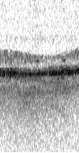
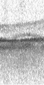
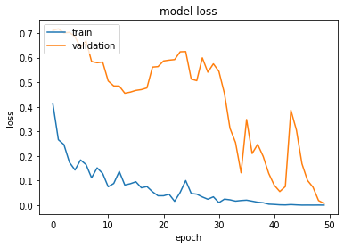
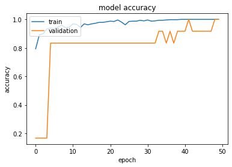
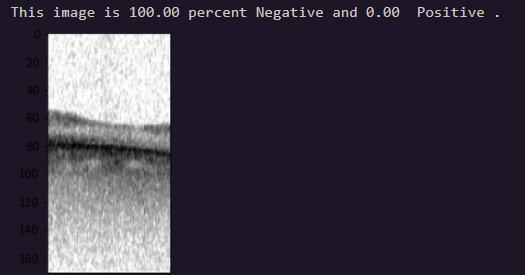

# Retina Classifier
## General info
This repo refers to the Retina Classifier project. The aim of the project is to provide a classifier able to distinguish patological cases from heatlhy patients. 
The images provided are collected with the [IOL master](https://www.zeiss.com/meditec/int/product-portfolio/optical-biometers/iolmaster-500.html) tool. The images obtained are in gray scale and are processed in the standard size 180*180 

  
  

For more details about IOL master images and why this could be usefull in clinic, check out our work about *Swept-Source Optical Coherence Tomography Biometer as Screening Strategy for Macular Disease in Patients Scheduled for Cataract Surgeryr* [[Scientific reports](https://www.nature.com/articles/s41598-019-46243-3#Abs1)]

## Model overview

 The proposed model is a small version of the Xception network, for further details have a look at this [Paper](https://arxiv.org/abs/1610.02357).

The [notebook](./retina.ipynb) was run in the Google Colab's GPU runtime reducing dramatically the training time. 

Some results about training metrics:

- Loss function 

- Accuracy

Here an example of the prediction result: 

